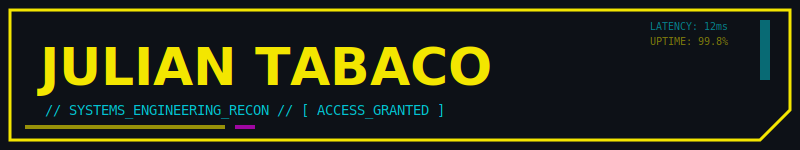
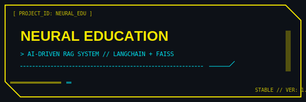
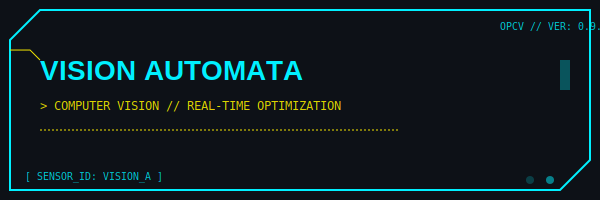

<!-- Header Section -->

  

  

  
  
  

 

<table width="100%">
  <tr>
    <td colspan="2">
      <h2 align="center">  [ SYSTEM_LOG ] // ABOUT_ME </h2>
      

        <blockquote>
          <b>// ACCESSING_ENCRYPTED_DATA...</b>  
          I am a <b>Systems Engineering student</b> with a tactical focus on <b>Backend Development</b> and <b>AI Integration</b>. My mission is to build robust, scalable architectures that bridge the gap between complex algorithms and real-world utility. 
            
          I specialize in crafting high-performance APIs and intelligent systems using <b>.NET, FastAPI, and Django</b>. My arsenal includes modern AI techniques like <b>RAG (Retrieval-Augmented Generation)</b>, utilizing <b>LangChain, FAISS, and Embeddings</b> to create neural-enhanced applications.
            
          <b>// CORE_VALUES:</b> Precision, Scalability, Intelligent Automation.
        </blockquote>
      

    </td>
  </tr>
  
  <tr>
    <td colspan="2"> </td>
  </tr>

  <tr>
    <td colspan="2">
      <h2 align="center">  [ LOADOUT ] // TECHNOLOGIES </h2>
    </td>
  </tr>
  
  <tr>
    <th width="50%">⚡ BACKEND_CORE</th>
    <th width="50%">🧠 NEURAL_NETWORKS_&_AI</th>
  </tr>
  <tr>
    <td align="center">
      
      
      
       
      
      
    </td>
    <td align="center">
      
      
       
      
      
    </td>
  </tr>
  <tr>
    <th width="50%">🌐 FRONTEND_INTERFACES</th>
    <th width="50%">🗄️ DATA_STORES</th>
  </tr>
  <tr>
    <td align="center">
      
      
       
      
    </td>
    <td align="center">
      
      
       
      
    </td>
  </tr>

  <tr>
    <td colspan="2"> </td>
  </tr>

  <tr>
    <td colspan="2">
      <h2 align="center">  [ MISSION_LOGS ] // RECENT_PROJECTS </h2>
    </td>
  </tr>

  <tr>
    <td align="center">
      
      

        <b>AI system for education based on RAG.</b> 
        
        
      

    </td>
    <td align="center">
      
      

        <b>Real-time vision optimization solution.</b> 
        
        
      

    </td>
  </tr>

  <tr>
    <td colspan="2"> </td>
  </tr>

  <tr>
    <td colspan="2">
      <h2 align="center">  [ PERFORMANCE_METRICS ] // DASHBOARD </h2>
    </td>
  </tr>
  
  <tr>
    <td colspan="2" align="center">
      
      
    </td>
  </tr>
</table>

 

<h2 align="center"> [ ESTABLISH_CONNECTION ] </h2>

  
  
  

  

